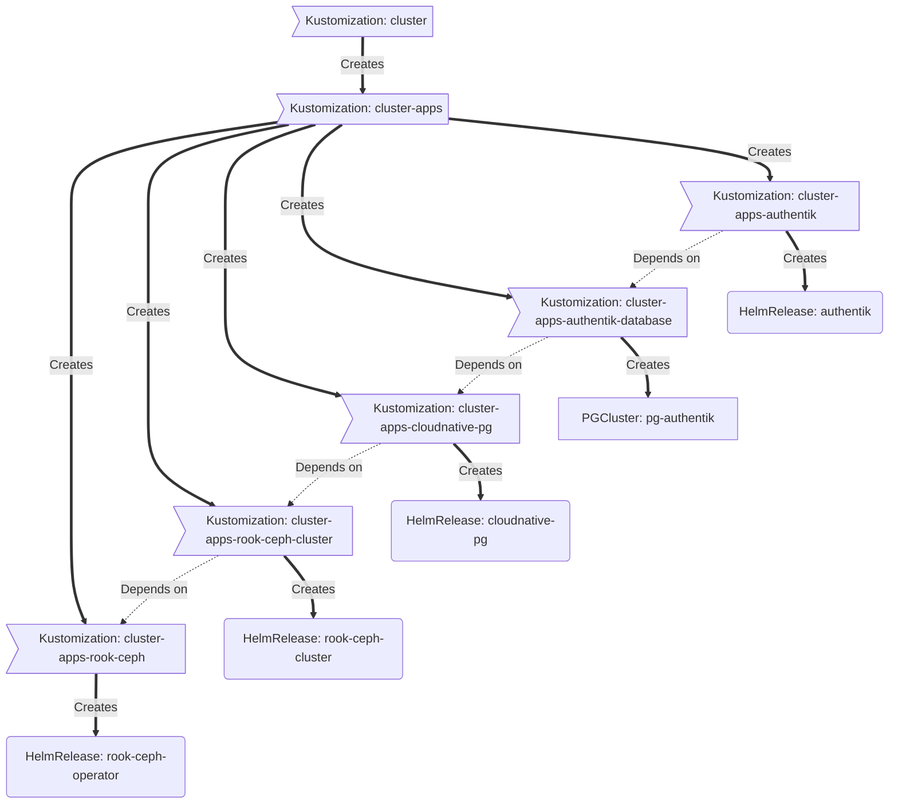

# k8s-HomeOps

### Core Components

- [actions-runner-controller](https://github.com/actions/actions-runner-controller): Self-hosted Github runners.
- [cert-manager](https://cert-manager.io/docs/): Creates SSL certificates for services in my Kubernetes cluster.
- [external-dns](https://github.com/kubernetes-sigs/external-dns): Automatically manages DNS records for my cluster.
- [metallb](https://metallb.universe.tf/): Bare-Metal Load-balancer
implementation.
- [ingress-nginx](https://github.com/kubernetes/ingress-nginx/): Ingress controller to expose HTTP traffic to pods over DNS.
- [synology-csi](https://github.com/SynologyOpenSource/synology-csi): The official Container Storage Interface driver for Synology NAS.
- [sops](https://toolkit.fluxcd.io/guides/mozilla-sops/): Managed secrets for Kubernetes, Ansible and Terraform which are commited to Git.
- [tf-controller](https://github.com/weaveworks/tf-controller): Additional Flux component used to run Terraform from within a Kubernetes cluster.
- [volsync](https://github.com/backube/volsync) and [snapscheduler](https://github.com/backube/snapscheduler): Backup and recovery of persistent volume claims.
- [system-upgrade-controller](https://github.com/rancher/system-upgrade-controller) Automatically updates kubernetes based off of a plan.

### GitOps

[Flux](https://github.com/fluxcd/flux2) watches my [kubernetes](./kubernetes/) folder (see Directories below) and makes the changes to my cluster based on the YAML manifests.

The way Flux works for me here is it will recursively search the [./kubernetes/jsdyb-k8s-001/apps](./kubernetes/jsdyb-k8s-001/apps) folder until it finds the most top level `kustomization.yaml` per directory and then apply all the resources listed in it. That aforementioned `kustomization.yaml` will generally only have a namespace resource and one or many Flux kustomizations. Those Flux kustomizations will generally have a `HelmRelease` or other resources related to the application underneath it which will be applied.

[Renovate](https://github.com/renovatebot/renovate) watches my **entire** repository looking for dependency updates, when they are found a PR is automatically created. When some PRs are merged [Flux](https://github.com/fluxcd/flux2) applies the changes to my cluster.

### Directories

This Git repository contains the following directories under [kubernetes](./kubernetes/).

```sh
📁 k8s-home-ops
├── 📁 kubernetes                 # kubernetes configurations
│   ├── 📁 apps                   # applications
│   │   └─ 📁 network             # namespace folder
│   │      └─ 📁 cert-manager     # application folder
│   ├── 📁 bootstrap              # bootstrap procedures
│   ├── 📁 flux                   # core flux configuration
│   └── 📁 templates              # re-useable components
└── 📁 infrastructure             # infrastructure configuration
```

### Cluster layout

Below is a a high level look at the layout of how my directory structure with Flux works. In this brief example you are able to see that `authentik` will not be able to run until `cloudnative-pg` is ready, which itself requires `rook-ceph-cluster` to be ready



